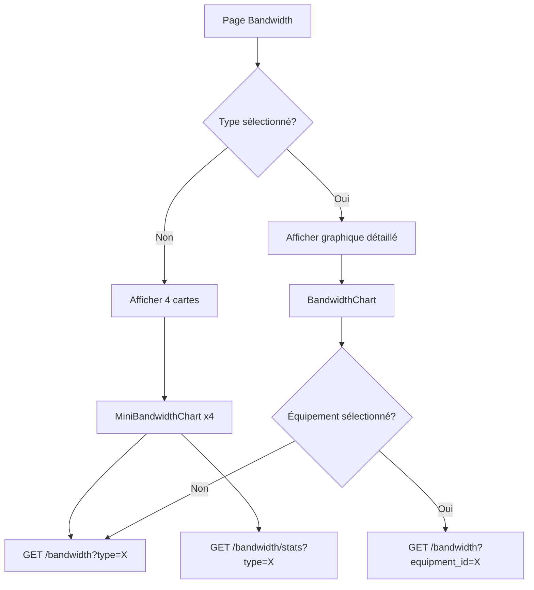

# Analyse de la Page Bande Passante

## 📊 Vue d'ensemble

La page **Bandwidth** (`frontend/src/views/Bandwidth.jsx`) affiche la consommation de bande passante par type d'équipement avec des graphiques interactifs et des statistiques en temps réel.

---

## 🎯 Fonctionnalités principales

### 1. **Vue d'ensemble par type d'équipement**
- **4 cartes cliquables** représentant chaque type d'équipement :
  - 📹 **Caméras**
  - 🔀 **Switches**
  - 💻 **PC**
  - 🖥️ **Serveurs**

- Chaque carte affiche :
  - Nombre total d'équipements de ce type
  - **Mini-graphique de bande passante** (dernières 24h)
  - **Statistiques** : Max, Moyenne, Min
  - **Statut actuel** : 🟢 Faible / 🟡 Moyenne / 🔴 Élevée

### 2. **Vue détaillée par type**
- Au clic sur une carte, affichage d'un **graphique détaillé** pour ce type
- **Filtre par équipement spécifique** disponible
- Graphique avec :
  - Courbe de bande passante (ligne rouge)
  - Zone sous la courbe (gradient rouge)
  - Points interactifs avec info-bulle (heure + valeur)
  - Statistiques en temps réel (Actuel, Moyenne, Max 24h)

### 3. **Rafraîchissement automatique**
- Mini-graphiques : toutes les **30 secondes**
- Graphique détaillé : toutes les **2 minutes**

---

## 🔧 Composants principaux

### `MiniBandwidthChart`
**Rôle** : Afficher un mini-graphique de bande passante sur les cartes de la vue d'ensemble.

**Props** :
- `equipmentType` : Type d'équipement (Camera, Switch, PC, Server)
- `size` : Taille du graphique (défaut : 200)

**Fonctionnement** :
1. Récupère les données depuis :
   - `GET /bandwidth?type={equipmentType}&hours=24`
   - `GET /bandwidth/stats?type={equipmentType}&hours=24`
2. Affiche un graphique SVG avec courbe et zone
3. Si aucune donnée : affiche "Aucune donnée" avec message informatif
4. Gestion des erreurs d'authentification (token expiré)

**Rendu** :
```jsx
<div className="mini-bandwidth-chart">
  <div className="mini-chart-header">
    <div className="chart-title">Bande passante</div>
    <div className="current-value">
      <span className="value">25.3 Mbps</span>
      <span className="status">🟡 Moyenne</span>
    </div>
  </div>
  <svg>...</svg>
  <div className="mini-chart-stats">
    <div>Max: 45.2 Mbps</div>
    <div>Moy: 25.3 Mbps</div>
    <div>Min: 10.1 Mbps</div>
  </div>
</div>
```

---

### `BandwidthChart`
**Rôle** : Afficher le graphique détaillé de bande passante pour un type d'équipement.

**Props** :
- `equipmentType` : Type d'équipement
- `equipmentList` : Liste des équipements de ce type
- `selectedEquipment` : Équipement sélectionné (optionnel)
- `onEquipmentSelect` : Callback pour sélectionner un équipement

**Fonctionnement** :
1. Récupère les données depuis :
   - `GET /bandwidth?type={equipmentType}&hours=24`
   - Si équipement sélectionné : `GET /bandwidth?equipment_id={id}&hours=24`
2. Affiche un graphique SVG 800x200 avec :
   - Grille de fond
   - Zone sous la courbe (gradient)
   - Ligne de bande passante (rouge)
   - Points interactifs
3. Légendes horaires au bas du graphique
4. Statistiques en temps réel

**Rendu** :
```jsx
<div className="bandwidth-chart-container">
  <div className="bandwidth-chart-header">
    <h2>Bande Passante - Switches</h2>
    <select><!-- Filtre par équipement --></select>
  </div>
  <svg width="800" height="200">...</svg>
  <div className="bandwidth-stats">
    <div>Actuel: 32.5 Mbps</div>
    <div>Moyenne: 28.1 Mbps</div>
    <div>Max 24h: 45.8 Mbps</div>
  </div>
</div>
```

---

## 📡 API utilisées

### 1. **Récupération des données de bande passante**
```http
GET /bandwidth?type={equipmentType}&hours=24
GET /bandwidth?equipment_id={id}&hours=24
```

**Réponse** :
```json
[
  {
    "timestamp": "2025-12-01T10:00:00Z",
    "value_mbps": 25.3,
    "equipment_id": 123
  },
  ...
]
```

### 2. **Statistiques de bande passante**
```http
GET /bandwidth/stats?type={equipmentType}&hours=24
GET /bandwidth/stats?equipment_id={id}&hours=24
```

**Réponse** :
```json
{
  "max_mbps": 45.8,
  "avg_mbps": 28.1,
  "min_mbps": 10.5,
  "count": 288
}
```

### 3. **Liste des équipements**
```http
GET /equipment
```

**Réponse** :
```json
[
  {
    "id": 123,
    "name": "FED-VIDG3ST2",
    "type": "Switch",
    "ip": "172.16.5.3",
    ...
  },
  ...
]
```

---

## 🎨 Styles et apparence

### Classes CSS utilisées
- `.mini-bandwidth-chart` : Conteneur du mini-graphique
- `.bandwidth-chart` : Conteneur du graphique détaillé
- `.bandwidth-header` : En-tête avec titre et valeur actuelle
- `.bandwidth-stats` : Statistiques (Max, Moy, Min)
- `.bandwidth-labels` : Légendes horaires
- `.bandwidth-point` : Points interactifs sur la courbe
- `.no-data-overlay` : Message "Aucune donnée"

### Seuils de couleur pour le statut
- **🟢 Faible** : < 15 Mbps
- **🟡 Moyenne** : 15-30 Mbps
- **🔴 Élevée** : > 30 Mbps

---

## 🔄 Flux de données



---

## 📝 Modifications récentes (Page Home)

### Remplacement de la carte de bande passante globale
**Avant** :
- Une seule carte `LineChart` affichant la bande passante globale de tous les équipements

**Après** :
- **Deux cartes** `SwitchBandwidthCard` côte à côte :
  1. **FED-VIDG3ST2** (172.16.5.3)
  2. **SWVID-PI2-STK1-2** (172.16.5.220)

### Nouveau composant `SwitchBandwidthCard`
**Fonctionnalités** :
- Récupère l'ID du switch par son nom
- Affiche le graphique de bande passante pour ce switch spécifique
- Rafraîchissement automatique toutes les 60 secondes
- Gestion des états : chargement, aucune donnée, affichage

**Props** :
- `switchName` : Nom du switch
- `switchIp` : IP du switch (affichage uniquement)

**Rendu** :
- Identique à `LineChart` mais pour un switch spécifique
- Titre : Nom du switch + IP
- Graphique SVG avec courbe, zone, points
- Statistiques : Max 24h, Moyenne, Min 24h

---

## ⚠️ Gestion des erreurs

### Aucune donnée disponible
- Affichage d'un message informatif
- Suggestion d'utiliser l'API `/bandwidth/ingest` pour ajouter des données
- Graphique vide avec structure préservée

### Erreur d'authentification (401)
- Message : "Non authentifié - token expiré ou manquant"
- Pas de données affichées
- Suggestion de reconnexion

### Erreur API (500, etc.)
- Log de l'erreur dans la console
- Affichage de données vides
- Message d'erreur générique

---

## 🚀 Évolutions possibles

1. **Alertes de seuil** : Notification si bande passante > X Mbps
2. **Export des données** : CSV, PDF, Excel
3. **Comparaison** : Comparer plusieurs équipements côte à côte
4. **Prédiction** : ML pour prédire les pics de consommation
5. **Historique** : Graphiques sur 7 jours, 30 jours, 1 an
6. **Zoom** : Sélection de plages horaires personnalisées

---

## 📌 Notes techniques

### Optimisations
- Utilisation de `React.useCallback` pour éviter les re-renders inutiles
- Rafraîchissement asynchrone avec `setInterval`
- Nettoyage des intervals avec `clearInterval` dans `useEffect`

### Compatibilité
- SVG pour les graphiques (meilleure performance que Canvas)
- `viewBox` et `preserveAspectRatio="none"` pour la réactivité
- Gestion du responsive avec `width="100%"`

### Dépendances
- Aucune librairie de graphiques externe (D3.js, Chart.js, etc.)
- Tout est fait en SVG natif pour la légèreté

---

## 📚 Ressources

- **API Backend** : `backend/src/index.js` (routes `/bandwidth`)
- **Styles** : `frontend/src/styles.css` (classes `.bandwidth-*`)
- **Composants** : `frontend/src/views/Bandwidth.jsx`
- **Page d'accueil** : `frontend/src/views/Home.jsx` (cartes switches)

---

*Document généré le 1er décembre 2025*
